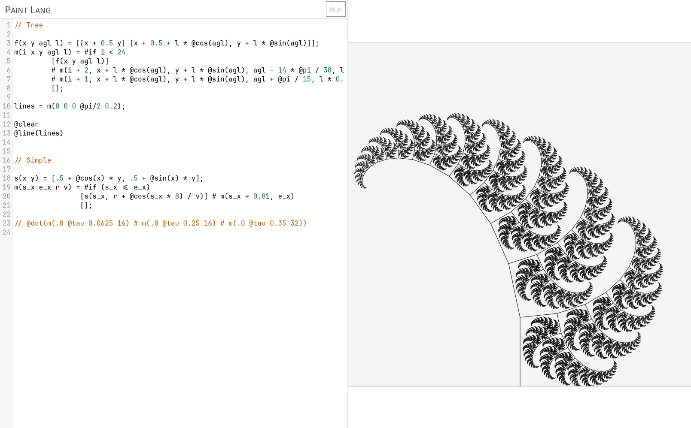

# Plant Lang

很久以前的一个小项目，实现了一个无歧义的迷你编程语言，可以用来绘制图形。



## 参考

```
// 这是一个注释

// 基本类型只有数字和数组

1;
3.14;
.5;
[];

// 数组内不使用分隔符，直接空格分隔

[1 2];

// 进行布尔运算时，1 代表真，0 代表假
1;
0;

// 运算符、函数、常量
// 注意算数运算没有优先级，一律右结合

!1;             // 布尔非
1 & 0;          // 布尔与
1 | 0;          // 布尔或
1 + 2;
1 - 2;
1 * 2;
1 / 2;
2 ^ 2;          // 幂
3 % 2;          // 模
[1 2] # [3 4];  // 数组连接
3 < 2;
3 > 2;
3 <= 2;
3 >= 2;
@cos(2);
@sin(2);
@log(2);        // 数学 Math.log
@pi;
@tau;           // 2 * @pi

// 绘图函数

// 清除画布
@clear;

// 画点
// points: [number<X坐标>, number<Y坐标>][]
@dot(points);

// 画线
// lines: points[]
// points: [number<X坐标>, number<Y坐标>][]
@line(lines)

// 打印值
// value: any
@print(value)

// 条件分支
// #if 实际上是一个三元运算符，直接使用空格分隔三个表达式

#if 1       // 条件表达式
    [1 2]   // 真分支表达式
    [3 4]   // 假分支表达式

// 循环语句
// 没有那种东西，使用递归代替

// 函数定义

add(arg1 arg2) = arg1 + arg2;
add(1 2);
```